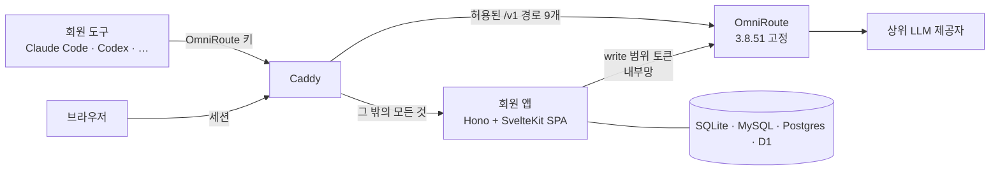

<div align="center">

<h1>magnetosphere</h1>

### **OmniRoute LLM 게이트웨이 앞에 회원과 사용량을 붙이는 계층.**

OmniRoute 는 이미 요청을 라우팅하고, API 키마다 사용량과 예산을 잽니다.
Magnetosphere 는 그 키 앞에 사람을 세웁니다. 가입, 로그인, 설치 도구를 붙이되
요청이 지나는 길에는 끼어들지 않습니다.

<br/>

[](https://github.com/henryj-dev/magnetosphere/actions/workflows/ci.yml)
[](https://github.com/henryj-dev/magnetosphere/actions/workflows/gate.yml)

<br/>


[](LICENSE)

<br/>

> *자기권(magnetosphere)은 행성을 둘러싸고 무엇이 지표에 닿을지 정하는 장입니다.
> 흐름 대부분은 그대로 지나가고, 막아야 할 것은 땅에 닿기 전에 가장자리에서 돌려보냅니다.*

[English](README.md) · 한국어

</div>

---

## 목차

- [문제](#문제)
- [무엇을 하는가](#무엇을-하는가)
- [빠른 시작](#빠른-시작)
- [구조](#구조)
- [설정](#설정)
- [운영](#운영)
- [개발](#개발)
- [현재 상태와 한계](#현재-상태와-한계)
- [라이선스](#라이선스)

---

## 문제

[OmniRoute](https://github.com/diegosouzapw/OmniRoute) 는 수백 개 LLM 제공자 앞에
엔드포인트 하나를 세우고, API 키마다 얼마를 썼는지 이미 압니다. 모르는 것은 그 키가
**누구 것인지**입니다. 여러 사람이 쓰려면 키를 손으로 나눠 주고, 사용량은 운영자만 보는
대시보드에서 읽어야 합니다.

| 회원 계층이 없으면 | 무엇이 깨지는가 |
|---|---|
| 키를 OmniRoute 대시보드에서 직접 만든다 | 새 사용자마다 손이 가고, 그 대시보드에는 모든 제공자 자격 증명이 있다 |
| 사용량이 운영자 대시보드에만 있다 | 사람들은 자기 사용량을 못 보고, 운영자는 사람 단위로 묶어 보지 못한다 |
| 공유하려고 게이트웨이를 인터넷에 연다 | `/v1/registered-keys` 같은 `/v1` 별칭이 회원 키에도 **200** 으로 답한다 (OmniRoute 3.8.51 실측) |

Magnetosphere 는 빠진 그 계층입니다. 계정, 설치 도구, 정확히 아홉 개 경로만 통과시키는
프록시. 그 이상은 하지 않습니다. 요청은 이 프로젝트의 코드를 거치지 않습니다.

---

## 무엇을 하는가

| 기능 | |
|---|---|
| 계정 | Better Auth 기반 이메일·비밀번호, 이메일 인증, 한 번만 쓰는 비밀번호 재설정 |
| 잠긴 설치 | 첫 관리자가 생기기 전에는 가입을 거부한다. 권한 칼럼(`role`, 한도, `is_bootstrap_admin`)은 어떤 요청 본문으로도 바꿀 수 없다 |
| 최초 설치 | 한 번만 출력되고 해시로만 저장되는 설치 토큰으로 첫 관리자를 만든다 |
| OmniRoute 연결 | 설치 때 **`write`** 범위 OmniRoute 접근 토큰을 발급해 암호화(AES-256-GCM, 저장 자리에 묶음)해 둔다 |
| 좁은 입구 | Caddy 가 `/v1` 경로 아홉 개만 OmniRoute 로 넘긴다. 그 밖의 `/v1/*` 는 404, OmniRoute `/api/*` 와 대시보드는 공개되지 않는다 |
| 클라이언트를 아는 요청 수 제한 | 로그인·가입·비밀번호 재설정·설치에 클라이언트 IP 별 제한. `X-Forwarded-For` 는 Caddy 주소에서 온 것만 믿는다 |
| 메일 | SMTP, Resend, Cloudflare Email Service, 개발용 콘솔. 응답과 떼어 보내 응답 시간으로 계정 존재가 드러나지 않는다 |
| 배포 형태 여섯 | Docker 에 SQLite·MySQL·Postgres, Cloudflare Workers 에 D1·MySQL·Postgres(Hyperdrive) |
| SSO 기반 | `@better-auth/sso` 플러그인을 넣되 공개 관리 경로는 **모두** 막았다. OIDC·SAML 화면은 다음 단계다 |

---

## 빠른 시작

Docker(Compose v2), Node 24, pnpm 11 이 필요합니다. 한 서버에 회원 앱, OmniRoute,
Caddy 를 띄웁니다.

```bash
git clone https://github.com/henryj-dev/magnetosphere
cd magnetosphere
corepack enable
pnpm install --frozen-lockfile
```

**비밀 값 만들기.** `.env`(OmniRoute 와 회원 앱의 비밀 값 전부, 무작위)와
`.env.setup`(한 번만 쓰는 OmniRoute 비밀번호)을 씁니다. `.env` 가 이미 있으면 덮지 않습니다.

```bash
node scripts/init.mjs --db sqlite --url https://members.example.com
```

**띄우기.** 앱이 뜨기 전에 마이그레이션이 일회성 서비스로 돕니다.

```bash
docker compose up -d --wait
docker compose logs app | grep "최초 설치 토큰"
```

**첫 관리자 만들기.** `https://members.example.com/setup` 을 열고 토큰을 넣은 뒤 이메일과
비밀번호를 정합니다. 응답에 `omniroute: "connected"` 가 나와야 합니다. 그다음 OmniRoute
비밀번호를 앱 환경에서 뺍니다.

```bash
rm .env.setup
docker compose up -d app
```

> [!IMPORTANT]
> `.env.setup` 에는 OmniRoute 관리자 비밀번호가 들어 있고, 이 비밀번호로 **admin** 접근
> 토큰을 만들 수 있습니다. 회원 앱 환경에 남겨 두면 앱이 쓰는 `write` 범위가 의미 없어집니다.
> 관리자가 있는데 이 값이 남아 있으면 앱이 시작할 때마다 경고를 남깁니다.

상위 제공자는 SSH 터널로 OmniRoute 대시보드에서 등록합니다
(`ssh -L 20128:127.0.0.1:20128 <서버>` 뒤 `http://localhost:20128`). Claude Code 는
`https://members.example.com` 에, OpenAI 호환 도구는 `https://members.example.com/v1` 에
OmniRoute 키로 연결합니다.

---

## 구조



- **Caddy** 만 공개 포트를 엽니다. `X-Forwarded-For` 를 새로 쓰고, 클라이언트가 지어낸
  IP 헤더를 지우고, 앱이나 OmniRoute 에 닿기 전에 본문 크기를 제한합니다.
- **회원 앱** 은 계정, 설정, 설치 도구를 맡습니다. OmniRoute 관리 API 는 내부망으로만
  부르고, 요청이 지나는 길에는 없습니다.
- **OmniRoute** 는 원래 하던 일을 합니다. 라우팅, 대체 경로, 키별 지출과 예산. 대시보드는
  `127.0.0.1` 에만 묶입니다.

앱이 요청 경로에 끼지 않는 이유를 포함한 설계는
[docs/design/omniroute-member-layer.md](docs/design/omniroute-member-layer.md) 에 있습니다.

<details>
<summary><b>소스 트리</b></summary>

| 폴더 | 무엇이 있나 |
|---|---|
| `apps/server/` | Hono 서버. Node·Workers 진입점, 설치 도구, 마이그레이션 실행기 |
| `apps/web/` | SvelteKit SPA (`adapter-static`, `ssr = false`). 두 런타임이 같은 빌드를 제공 |
| `packages/db/` | 스키마 원본 하나에서 SQLite·MySQL·Postgres 스키마 생성, 마이그레이션, 시드 |
| `packages/auth/` | Better Auth 구성, 메일 어댑터, 요청 수 제한 |
| `packages/omniroute/` | OmniRoute 를 부르는 유일한 코드. 응답은 zod 로 검사 |
| `packages/runtime/` | Node·Workers 어댑터. DB, 주기 작업, 클라이언트 IP, 암호화 |
| `deploy/` | `Caddyfile`, Workers 배포 스크립트, [배포 안내](deploy/README.md) |
| `gates/`, `scripts/gate.mjs` | 단계 게이트와 봉인 ([개발](#개발) 참고) |

</details>

---

## 설정

아래 값은 전부 `node scripts/init.mjs` 가 씁니다. 각 값의 설명은 `.env.example` 에 있습니다.

<details open>
<summary><b>회원 앱</b></summary>

| 변수 | |
|---|---|
| `BETTER_AUTH_URL` | 공개 주소. 메일 속 링크는 `Host` 헤더가 아니라 이 값으로 만든다 |
| `BETTER_AUTH_SECRET` | 세션 서명. 32자 미만이면 앱이 시작을 거부한다 |
| `APP_ENCRYPTION_KEY` | 32바이트, base64. OmniRoute 토큰과 메일 자격 증명을 암호화한다 |
| `DATABASE_URL` | SQLite 는 `file:`, 그 밖에 `mysql://`, `postgres://` |
| `OMNIROUTE_URL` | 앱이 OmniRoute 관리 API 에 닿는 주소. Compose 에서는 `http://omniroute:20128` |
| `OMNIROUTE_INITIAL_PASSWORD` | 최초 설치 때만, `.env.setup` 에서. 설치 뒤 지운다 |
| `SETUP_TOKEN` | Docker 는 선택, Workers 는 **필수**. 32자 이상 (`openssl rand -base64 32`) |
| `TRUSTED_PROXIES` | `X-Forwarded-For` 를 보낼 수 있는 상대. 기본은 Caddy 주소 `/32` |

</details>

<details>
<summary><b>OmniRoute</b> — 재시작해도 자기 데이터를 잠그지 않게 고정</summary>

| 변수 | |
|---|---|
| `INITIAL_PASSWORD` | OmniRoute 가 사람 없이 시작하는 데 실제로 필요한 유일한 값 |
| `JWT_SECRET` · `API_KEY_SECRET` · `STORAGE_ENCRYPTION_KEY` · `OMNIROUTE_WS_BRIDGE_SECRET` | 비워 두면 OmniRoute 가 데이터 볼륨에 만들어 둔다. 나중에 `STORAGE_ENCRYPTION_KEY` 가 바뀌면 시작하지 못하므로 여기서 고정한다 |
| `REQUIRE_API_KEY` | 항상 `true`. OmniRoute 의 `.env.example` 에는 `false` 로 적혀 있다 |

</details>

<details>
<summary><b>네트워크</b></summary>

| 변수 | |
|---|---|
| `SITE_ADDRESS` | Caddy 가 서비스하는 주소. 도메인이면 HTTPS 와 HSTS 가 자동으로 붙는다 |
| `EDGE_SUBNET` · `CADDY_EDGE_IP` · `EDGE_IP_RANGE` | Caddy 전용 망. `10.203.57.0/29` 가 겹치면 셋을 함께 바꾼다 |

</details>

---

## 운영

### 무엇이 공개되는가

| 경로 | 가는 곳 |
|---|---|
| `/v1/messages` · `/v1/messages/count_tokens` · `/v1/chat/completions` · `/v1/completions` · `/v1/responses` · `/v1/responses/*` · `/v1/embeddings` · `/v1/models` · `/v1/models/*` | OmniRoute |
| 그 밖의 `/v1/*` | Caddy 에서 404 |
| 그 밖의 모든 경로 | 회원 앱 |

이 목록은 Claude Code 와 Codex 의 실제 요청에서 뽑았습니다
([docs/verify/V16.json](docs/verify/V16.json)). `/v1` 을 접두사째로 열면 다른 회원의 키
목록과 라우팅 정보가 드러납니다.

> [!WARNING]
> OmniRoute `20128` 포트와 `/api/*` 를 인터넷에 열지 마세요. 그것들을 넘기는 Caddy 규칙도
> 더하지 마세요. 대시보드는 SSH 터널로만 씁니다.

### 인스턴스를 여럿 둘 때

첫 관리자는 앱 인스턴스 하나로 만들고, 그다음에 늘립니다
(`docker compose up -d --scale app=N`, MySQL·Postgres 프로필). 관리자 없이 여럿을 띄우면
각자 설치 토큰을 만들어 서로 덮습니다.

### Cloudflare Workers

`apps/server/wrangler.toml` 에 환경이 셋 있습니다. `d1`, `mysql`, `pg`. 실제 D1 또는
Hyperdrive id 와 `BETTER_AUTH_URL` 을 넣고 시크릿을 등록한 뒤 배포합니다.

```bash
node deploy/workers-deploy.mjs --env d1
```

배포 전에 마이그레이션을 먼저 적용합니다. OmniRoute 는 여전히 서버 한 대에서 돕니다.
관리 연결이 생기기 전까지 Workers 배포는 설치 화면에서 OmniRoute 접근 토큰을 붙여 넣고,
OmniRoute 에는 Cloudflare Tunnel 과 Access 로만 닿습니다. 자세한 내용은
[deploy/README.md](deploy/README.md) 에 있습니다.

---

## 개발

```bash
pnpm install --frozen-lockfile
pnpm typecheck
pnpm test:scripts                    # 게이트 장치와 그 음성 대조
docker compose -f docker-compose.test.yml up -d --wait   # MySQL, MariaDB, Postgres
node scripts/gate.mjs S4             # 한 단계의 검사
pnpm test:contract                   # 고정 버전 OmniRoute 실물 상대
pnpm e2e --combo docker-sqlite       # 설치 → 관리자 → OmniRoute → 로그인
```

**작업은 테스트만이 아니라 게이트로 막습니다.**
[docs/plan/phase1-todo.md](docs/plan/phase1-todo.md) 의 계획은 단계로 나뉩니다. 단계마다의
검사는 `gates/gates.config.mjs` 의 데이터이고, `scripts/gate.mjs` 는 새로 돌린 검사가 모두
통과할 때만 `gates/seals/` 에 봉인을 씁니다.

- 앞 단계가 봉인되지 않으면 다음 단계는 실행되지 않습니다.
- 봉인된 커밋을 되돌리면 그 봉인은 무효가 됩니다.
- 손으로 고친 봉인은 `--verify-seals --rerun` 에서 걸립니다. 봉인 커밋을 꺼내 검사를 다시 돌립니다.
- pre-push 훅과 CI 가 잠긴 단계의 파일 변경을 거부합니다.

모든 테스트에는 "이 테스트가 없으면 무엇을 놓치는가"가 적혀 있고, 모든 검사에는 지키는
대상을 일부러 깨뜨려 실패를 확인한 음성 대조가 있습니다.

**CI.** `ci.yml` 은 단계마다 필요한 서비스를 띄운 잡에서 그 단계의 게이트를 돌리고, S1 은
봉인 커밋에서 다시 돌리고, 배포 조합 여섯을 끝까지 돌립니다. `scripts/check-ci-matrix.mjs`
는 게이트 스텝이 건너뛰어지거나, `|| true` 로 감싸지거나, `continue-on-error` 가 붙거나,
경로 필터로 걸러지면 빌드를 실패시킵니다. `main` 은 CI 잡이 모두 통과해야 병합됩니다.

---

## 현재 상태와 한계

**되는 것.** 1단계(뼈대)를 끝내고 봉인했습니다. 여섯 조합(Docker × SQLite·MySQL·Postgres,
Workers × D1·MySQL·Postgres) 모두에서 설치, 첫 관리자 생성, OmniRoute 연결, 로그인이
끝까지 됩니다. 인증과 재설정이 있는 이메일·비밀번호 계정, 메일 어댑터 넷, 클라이언트별 요청
수 제한, 암호화된 설정, Caddy 허용 목록, 그리고 키·예산·분석·호출 로그를 다루는 계약 테스트
된 OmniRoute 어댑터.

**아직 안 되는 것.** 회원이 키를 발급하거나 사용량을 볼 수는 아직 없습니다. 어댑터는 있고
화면이 없습니다. **첫 관리자가 생긴 뒤에는 이메일 가입이 열려 있어** 주소를 인증할 수 있는
누구나 가입합니다. 계획한 기본값(`invite_only`)과 다른 가입 정책, 초대, 승인, 관리 화면,
OIDC·SAML 로그인은 아직 만들지 않았습니다. 그때까지는 배포를 별도의 접근 제어 뒤에 두세요.
Workers 배포에는 OmniRoute 관리 API 로 가는 관리된 연결이 없어 토큰을 붙여 넣습니다.
OmniRoute 예산은 키 단위이고 60초마다 집계되어, 짧게 몰아 쓰면 회원 월 한도를 잠깐 넘을 수
있습니다. 비용은 제공자 청구서가 아니라 OmniRoute 가격표 기준 추정치입니다. 고정한 OmniRoute
이미지는 amd64 와 arm64 의 빌드가 달라 예산 초과 오류 코드가 다릅니다. 둘 다 테스트합니다.

**아직 굳지 않은 것.** DB 스키마는 출시 전까지 다시 만드는 초기 마이그레이션 하나를 씁니다.
HTTP 경로, 환경 변수 이름, `gates.config.mjs` 형식은 바뀔 수 있습니다.

---

## 라이선스

MIT. [LICENSE](LICENSE) 를 보세요.
