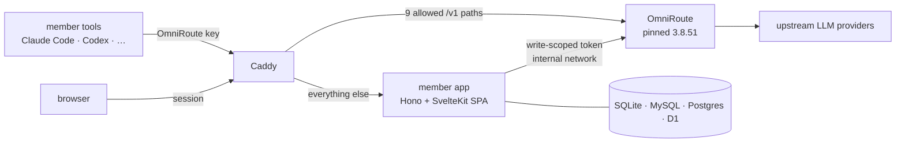

<div align="center">

<h1>magnetosphere</h1>

### **A member and usage layer for the OmniRoute LLM gateway.**

OmniRoute already routes, meters and budgets every request per API key.
Magnetosphere puts people in front of those keys — sign-up, sign-in and an
installer — without ever sitting in the request path.

<br/>

[](https://github.com/henryj-dev/magnetosphere/actions/workflows/ci.yml)
[](https://github.com/henryj-dev/magnetosphere/actions/workflows/gate.yml)

<br/>


[](LICENSE)

<br/>

> *A magnetosphere is the field around a planet that decides what reaches the
> surface — most of the stream is let through untouched, and what isn't is
> turned away at the edge, before it lands.*

English · [한국어](README.ko.md)

</div>

---

## Contents

- [The problem](#the-problem)
- [What it does](#what-it-does)
- [Quick start](#quick-start)
- [How it fits together](#how-it-fits-together)
- [Configuration](#configuration)
- [Operations](#operations)
- [Development](#development)
- [Status & limitations](#status--limitations)
- [License](#license)

---

## The problem

[OmniRoute](https://github.com/diegosouzapw/OmniRoute) gives you one endpoint in
front of hundreds of LLM providers, and it already knows how much every API key
spent. What it does not know is *who* a key belongs to. Running it for more than
one person means handing out keys by hand and reading usage off an operator
dashboard nobody else can see.

| Without a member layer | What goes wrong |
|---|---|
| Keys are minted in the OmniRoute dashboard | Every new user is a manual step, and the dashboard holds every provider credential |
| Usage lives on the operator dashboard | People cannot see their own spend; the operator cannot group it by person |
| The gateway is opened to the internet to share it | `/v1` aliases such as `/v1/registered-keys` answer **200** to any member key (measured, OmniRoute 3.8.51) |

Magnetosphere is the missing layer — accounts, an installer, and a proxy that
lets exactly nine paths through — and nothing more. Requests never pass through
its code.

---

## What it does

| Feature | |
|---|---|
| Accounts | Email and password through Better Auth, with email verification and one-time password resets |
| Locked-down install | Sign-up is refused until the first admin exists; privilege columns (`role`, limits, `is_bootstrap_admin`) cannot be set from any request body |
| First install | A one-time setup token, printed once and stored only as a hash, creates the first admin |
| OmniRoute bootstrap | The installer mints a **`write`**-scoped OmniRoute access token and stores it encrypted (AES-256-GCM, field-bound) |
| A narrow front door | Caddy forwards exactly nine `/v1` paths to OmniRoute; every other `/v1/*` is a 404 and OmniRoute's `/api/*` and dashboard are never public |
| Rate limits that see the client | Login, sign-up, password reset and setup are rate-limited per client IP, trusting `X-Forwarded-For` only from the Caddy address |
| Mail | SMTP, Resend, Cloudflare Email Service, or the console in development — sent off the response path so timing does not reveal accounts |
| Six deployment shapes | Docker with SQLite, MySQL or Postgres; Cloudflare Workers with D1, MySQL or Postgres (Hyperdrive) |
| SSO plumbing | The `@better-auth/sso` plugin is installed with **every** public management route disabled; OIDC/SAML screens come later |

---

## Quick start

You need Docker with Compose v2, Node 24 and pnpm 11. This brings up the member
app, OmniRoute and Caddy on one machine.

```bash
git clone https://github.com/henryj-dev/magnetosphere
cd magnetosphere
corepack enable
pnpm install --frozen-lockfile
```

**Generate secrets.** This writes `.env` (every OmniRoute and member-app secret,
random) and `.env.setup` (the OmniRoute password, used once). It refuses to
overwrite an existing `.env`.

```bash
node scripts/init.mjs --db sqlite --url https://members.example.com
```

**Start it.** Migrations run as a one-shot service before the app starts.

```bash
docker compose up -d --wait
docker compose logs app | grep "최초 설치 토큰"
```

**Create the first admin.** Open `https://members.example.com/setup`, paste the
token, and choose an email and password. The response should say
`omniroute: "connected"`. Then take the OmniRoute password out of the app's
environment:

```bash
rm .env.setup
docker compose up -d app
```

> [!IMPORTANT]
> `.env.setup` holds the OmniRoute admin password, which can mint an **admin**
> access token. Leaving it in the member app's environment defeats the `write`
> scope the app runs with. The app logs a warning on every start while an admin
> exists and the password is still set.

Register your upstream providers in the OmniRoute dashboard over an SSH tunnel
(`ssh -L 20128:127.0.0.1:20128 <server>`, then `http://localhost:20128`). Point
Claude Code at `https://members.example.com` with an OmniRoute key, or an
OpenAI-compatible tool at `https://members.example.com/v1`.

---

## How it fits together



- **Caddy** is the only public port. It overwrites `X-Forwarded-For`, drops
  client-supplied IP headers, and enforces body limits before the app or
  OmniRoute sees a byte.
- **The member app** owns accounts, settings and the installer. It talks to
  OmniRoute's management API over the internal network, never on the request path.
- **OmniRoute** does what it already does: routing, fallbacks, per-key spend and
  budgets. Its dashboard is bound to `127.0.0.1`.

The design, including why the app stays out of the request path, is in
[docs/design/omniroute-member-layer.md](docs/design/omniroute-member-layer.md).

<details>
<summary><b>The source tree</b></summary>

| Directory | What lives there |
|---|---|
| `apps/server/` | Hono server — Node and Workers entries, the installer, migrations runner |
| `apps/web/` | SvelteKit SPA (`adapter-static`, `ssr = false`), served by both runtimes |
| `packages/db/` | One schema source generating SQLite, MySQL and Postgres schemas; migrations; seed |
| `packages/auth/` | Better Auth configuration, mail adapters, rate limiting |
| `packages/omniroute/` | The only code that calls OmniRoute; responses validated with zod |
| `packages/runtime/` | Node and Workers adapters — DB, scheduling, client IP, encryption |
| `deploy/` | `Caddyfile`, Workers deploy script, [deployment notes](deploy/README.md) |
| `gates/`, `scripts/gate.mjs` | The stage gates and their seals (see [Development](#development)) |

</details>

---

## Configuration

`node scripts/init.mjs` writes every value below. `.env.example` documents each one.

<details open>
<summary><b>Member app</b></summary>

| Variable | |
|---|---|
| `BETTER_AUTH_URL` | The public origin. Links in emails are built from this, never from the `Host` header |
| `BETTER_AUTH_SECRET` | Session signing. At least 32 characters or the app refuses to start |
| `APP_ENCRYPTION_KEY` | 32 bytes, base64. Encrypts the OmniRoute token and mail credentials |
| `DATABASE_URL` | `file:` for SQLite, `mysql://`, or `postgres://` |
| `OMNIROUTE_URL` | Where the app reaches OmniRoute's management API. `http://omniroute:20128` in Compose |
| `OMNIROUTE_INITIAL_PASSWORD` | First install only, from `.env.setup`. Remove it afterwards |
| `SETUP_TOKEN` | Optional on Docker, **required** on Workers. At least 32 characters (`openssl rand -base64 32`) |
| `TRUSTED_PROXIES` | Who may set `X-Forwarded-For`. Defaults to the Caddy address `/32` |

</details>

<details>
<summary><b>OmniRoute</b> — pinned so a restart never locks its own data</summary>

| Variable | |
|---|---|
| `INITIAL_PASSWORD` | The only value OmniRoute truly requires to start unattended |
| `JWT_SECRET` · `API_KEY_SECRET` · `STORAGE_ENCRYPTION_KEY` · `OMNIROUTE_WS_BRIDGE_SECRET` | OmniRoute would generate these into its data volume; changing `STORAGE_ENCRYPTION_KEY` later stops it from starting, so they are fixed here |
| `REQUIRE_API_KEY` | Always `true`. OmniRoute's own `.env.example` says `false` |

</details>

<details>
<summary><b>Network</b></summary>

| Variable | |
|---|---|
| `SITE_ADDRESS` | What Caddy serves — a domain gets automatic HTTPS and HSTS |
| `EDGE_SUBNET` · `CADDY_EDGE_IP` · `EDGE_IP_RANGE` | The Caddy-only network. Change all three together if `10.203.57.0/29` collides |

</details>

---

## Operations

### What is public

| Path | Goes to |
|---|---|
| `/v1/messages` · `/v1/messages/count_tokens` · `/v1/chat/completions` · `/v1/completions` · `/v1/responses` · `/v1/responses/*` · `/v1/embeddings` · `/v1/models` · `/v1/models/*` | OmniRoute |
| any other `/v1/*` | 404 at Caddy |
| everything else | the member app |

The list was taken from real Claude Code and Codex traffic
([docs/verify/V16.json](docs/verify/V16.json)). Opening `/v1` as a prefix would
expose other members' key lists and routing details.

> [!WARNING]
> Never open OmniRoute's port `20128` or its `/api/*` to the internet, and do not
> add a Caddy rule that forwards them. The dashboard is for SSH tunnels only.

### Installing more than one instance

Create the first admin with a single app instance, then scale
(`docker compose up -d --scale app=N`, MySQL or Postgres profiles). Instances
started without an admin each mint their own setup token and overwrite each other.

### Cloudflare Workers

`apps/server/wrangler.toml` has three environments — `d1`, `mysql`, `pg`. Set the
real D1 or Hyperdrive ids and `BETTER_AUTH_URL`, add the secrets, then:

```bash
node deploy/workers-deploy.mjs --env d1
```

It applies migrations before deploying. OmniRoute still runs on one server; until
the managed connection exists, Workers deployments paste an OmniRoute access
token on the setup screen and reach OmniRoute only through Cloudflare Tunnel and
Access. Details: [deploy/README.md](deploy/README.md).

---

## Development

```bash
pnpm install --frozen-lockfile
pnpm typecheck
pnpm test:scripts                    # the gate device and its negative controls
docker compose -f docker-compose.test.yml up -d --wait   # MySQL, MariaDB, Postgres
node scripts/gate.mjs S4             # one stage's checks
pnpm test:contract                   # against a real, pinned OmniRoute
pnpm e2e --combo docker-sqlite       # install → admin → OmniRoute → login
```

**Work is gated, not just tested.** The plan in
[docs/plan/phase1-todo.md](docs/plan/phase1-todo.md) is split into stages. Each
stage's checks are data in `gates/gates.config.mjs`, and `scripts/gate.mjs`
writes a seal into `gates/seals/` only when all of them pass on a fresh run.

- A stage cannot run until the one before it is sealed.
- Reverting a sealed commit invalidates its seal.
- A seal edited by hand fails `--verify-seals --rerun`, which checks out the
  sealed commit and runs the checks again.
- The pre-push hook and CI refuse changes to a locked stage's files.

Every test names what it would miss if it did not exist, and every check has a
negative control that breaks the thing it guards and watches it fail.

**CI.** `ci.yml` runs each stage's gate in its own job with the services it
needs, re-runs stage S1 at its sealed commit, and runs all six deployment
combinations end to end. `scripts/check-ci-matrix.mjs` fails the build if a gate
step is skipped, wrapped in `|| true`, made `continue-on-error`, or filtered by
path. `main` requires every CI job to pass.

---

## Status & limitations

**What works.** Phase 1, the skeleton, is complete and sealed: install, first
admin, OmniRoute bootstrap and sign-in work end to end in all six combinations
(Docker × SQLite, MySQL, Postgres; Workers × D1, MySQL, Postgres). Email and
password accounts with verification and resets, four mail adapters, per-client
rate limiting, encrypted settings, the Caddy allowlist, and a contract-tested
OmniRoute adapter for keys, budgets, analytics and call logs.

**What doesn't yet.** Members cannot issue keys or see usage yet — the adapter
exists, the screens do not. **After the first admin exists, email sign-up is
open** to anyone who can verify an address; the planned default (`invite_only`)
and the other sign-up policies, invitations, approval, the admin console, and
OIDC or SAML sign-in are not built yet. Put the deployment behind your own
access control until they are. Workers deployments
have no managed connection to OmniRoute's management API and paste a token
instead. OmniRoute's budgets are per key and counted every 60 seconds, so a
member's monthly limit can be overrun briefly by bursty use, and costs are
estimates from OmniRoute's price table, not provider invoices. The pinned
OmniRoute image builds differently on amd64 and arm64 (the budget error code
differs); both are tested.

**Not frozen.** The database schema still uses a single initial migration that
is regenerated before release. HTTP routes, environment names and the
`gates.config.mjs` format may change.

---

## License

MIT. See [LICENSE](LICENSE).
